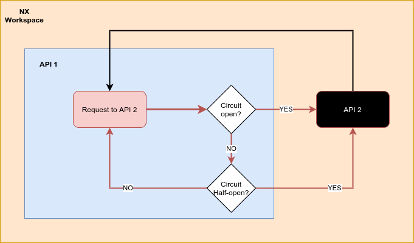

# POC-CIRCUIT-BREAKER

This poc is an example of how to implement a circuit breaker for avoiding wasting time and resource when a part of the system fail. A circuit breaker is a kind of protection for operation that are likely to fail. You avoid waiting on timeouts for the client, and a broken circuit avoids putting load on a struggling server. I made this POC using **Express** and **Node.js**. I have created a monorepository with two API using **NX**. The `api1` will be use to call the `api2`.

## Plan of the presentation

I explain with all the details how I build the project and my way of working.

- [Theory](#theory)
- [Running](#running)
- [System](#System)
- [Links](#links)

## Theory

A circuit breaker main purpose is to prevent the calls made to a broken endpoint. In this POC, the `API1` is calling the `API2`. It's possible to mimic a broken endpoint by starting or stopping the `API2`.

- In the case both APIs are running, the circuit is OPEN. The calls are succesfully made.

- If we stop the API2, the moment we will try to make call using API1, the calls will fail. The circuit will be OPEN until 3 fail calls are made. In which case the circuit will be closed.

- Once closed, after a certain time (3 seconds in this POC), a call will be attempt to the API2. Until it fails, the circuit will remain CLOSED and will be HALF-OPEN from time to time.

- If call are made sucessfully again, the circuit will come back to his OPEN state.

#### Flow



#### Mermaid


## Running

For running the API, the command from NX can be used:

```bash
$ nx serve api1
$ nx serve api2
$ nx run-many --parallel --target=serve --projects=api1,api2
```

## System

Ubuntu Version: Ubuntu 20.04.1 LTS
Node Version: v16.15.1

```bash
# Get the version of node
$ node -v

# Get the latest version of ubuntu
$ lsb_release -a
```

## Links

- [https://microservices.io/patterns/reliability/circuit-breaker.html](https://microservices.io/patterns/reliability/circuit-breaker.html)
- [https://blog.octo.com/circuit-breaker-un-pattern-pour-fiabiliser-vos-systemes-distribues-ou-microservices-partie-2/](https://blog.octo.com/circuit-breaker-un-pattern-pour-fiabiliser-vos-systemes-distribues-ou-microservices-partie-2/)
